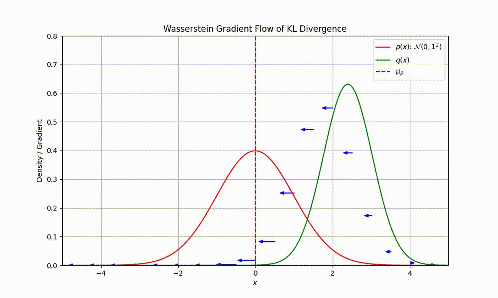

## The Langevin Diffusion

A major breakthrough, at least from a theoretical perspective, happened with Jordan, Kinderlehrer & Otto’s 1998 paper [*The Variational Formulation of the Fokker-Planck Equation*](https://doi.org/10.1137/S0036141096303359). In there, the authors made an explicit connection between the **Langevin diffusion**, a particular type of Stochastic Differential Equation (SDE) with very nice equilibrium properties, and a gradient flow in the space of probability distributions. The Langevin diffusion can be characterised by the SDE

$$
\mathrm{d}X_t = \nabla \log \pi(X_t) \mathrm{d}t + \sqrt{2}\mathrm{d}B_t
$$

where $\{B_t\}$ is a Brownian motion and $\pi$ is the equilibrium distribution of the process, and it could also be characterised by the **Fokker-Planck equation** 

$$
\partial_t p_t(x) = \text{div} \left( p_t(x) \nabla \log \frac{p_t(x)}{\pi(x)} \right)
$$

where $p_t(x)$ is the probability distribution of $X_t$. Naively, one can think about the two characterisations of the Langevin diffusion as a state space version and a distribution space version of the same motion. 

[https://twitter.com/i/status/1775387754664198278](https://twitter.com/i/status/1775387754664198278)

So, the paper of JKO1998 established that the Fokker-Planck equation of the Langevin diffusion is equivalent to a gradient flow in the **Wasserstein space** with the objective function being the KL divergence $f(\cdot) = \text{KL}(\cdot \| \pi)$ where 

$$
\text{KL}(p\| q) := \int p(x) \log[p(x) / q(x)] dx = \mathbb{E}_{X \sim p} [\log ( p(X)/q(X)) ].
$$

Intuitively, what this connection tells us is that the particles following a Langevin diffusion are moving - in the steepest direction - towards their equilibrium distribution. 

As an example, let's assume that our target distribution of interest $p$ is a Gaussian $\mathcal{N}(0,1)$ and particles are represented by the distribution $q$. As seen in the following movie, we can use the Wasserstein gradient flow of KL divergence to sequentially evolve $q$ and minimise the KL divergence.

(Thanks to Louis Sharrock for creating this movie)

This result seems neat, but what is so special about this Langevin diffusion? It turns out that the Langevin diffusion is rather fundamental in sampling algorithms for computational statistics. 

---
## Monte Carlo Sampling 

In statistics, especially in Bayesian statistics, we would often run into the problem of having a complicated probability distribution that we wish to compute expectations of, such as in the case of computing the posterior mean of a parameter of interest. If the distribution is complex and we cannot analytically evaluate our expectations of interest, then we often rely on using (independent) samples from the distribution to form an empirical approximation of the distribution. To be more precise, if we have a target probability distribution $\pi$, we will get a sequence of independent samples $X_1, X_2, \ldots, X_n \sim \pi$ and we have 

$$
\pi(x) \approx \frac{1}{n} \sum_{k=1}^n 1_{X_k}(x)
$$

where $1_{X_k}(x)$ is the indicator function that takes the value 1 when $x = X_k$ and zero otherwise. This is the **Monte Carlo method**, and it can be shown that under weak conditions of the target distribution $\pi$, the empirical distribution converges to $\pi$ at a rate of $O(1/\sqrt{n})$ for $n$ Monte Carlo samples. The only problem with the Monte Carlo method is, how do we get those samples? As alluded slightly from the Langevin diffusion, since we can set the equilibrium distribution of a Langevin diffusion to (almost) any target distribution and the process will converge to it after running for a while, we can just start the SDE at some point and run it for long enough so it hits the equilibrium, and use the trajectories afterwards as samples from the target distribution. 

Immediately, we would ask - how exactly do we simulate a continuous-in-time SDE? The simplest solution is to use the Euler-Maruyama scheme and obtain discretisations using the following iterative procedure

$$
X_{(n+1)h} = X_{nh} + h \nabla \log \pi(X_{nh})+\sqrt{2h} \xi
$$

where $\xi \sim N(0,1)$. This gives us the **unadjusted Langevin algorithm** (ULA), also known as the **Langevin Monte Carlo** (LMC) algorithm in the machine learning literature. 

Since this is a discretisation, it introduces some numerical errors (the precise reason for the errors will be explained in a bit) and by using ULA we will not obtain exact samples from the target distribution $\pi$. For sufficiently small $h$, the error would be tolerable. We could also do smart things such as **Metropolis adjustments** to remove the error, and we would recover the **Metropolis Adjusted Langevin Algorithm** (MALA) which is a staple of the **Markov chain Monte Carlo** (MCMC) algorithms for computational statistics. More thorough discussions on MCMC algorithms can be found in textbooks such as [*Monte Carlo Statistical Methods*](https://link.springer.com/book/10.1007/978-1-4757-4145-2) by Robert & Casella, or the recent [*Scalable Monte Carlo for Bayesian Learning*](https://arxiv.org/abs/2407.12751) by Fearnhead, Nemeth, Oates & Sherlock. One could also find a more detailed theoretical study of ULA in Roberts & Tweedie’s 1996 paper [*Exponential Convergence of Langevin Distributions and their Discrete Approximations*](https://projecteuclid.org/journals/bernoulli/volume-2/issue-4/Exponential-convergence-of-Langevin-distributions-and-their-discrete-approximations/bj/1178291835.full). 

---

## Wasserstein Gradient Flow - a Bridge between Sampling and Optimisation

So far, we have learnt that the Langevin diffusion can be viewed as a gradient flow, and the discrete-in-time version of the Langevin diffusion allows us to draw samples from a target distribution. It turns out that we can also interpret the discrete Langevin diffusion of the LMC as a discrete-in-time approximation of the corresponding gradient flow in the space of probability distributions (to be more precise, the Wasserstein space, so we would often call this type of gradient flow a *Wasserstein gradient flow*). 

In the 2018 paper [*Sampling as Optimization in the Space of Measures*](https://arxiv.org/abs/1802.08089) by Wibisono, the author pointed out that the LMC as an Euler-Maruyama discretisation of the Langevin diffusion can be viewed as a forward-flow splitting discretisation of the Wasserstein gradient flow with the objective function being the KL divergence. The forward-flow splitting scheme is a way to discretise time by doing half a step of forward discretisation, and half a step of flow discretisation, for each full step of the iteration. The expression of the two discretisations is slightly involved to describe in the space of probability distributions, but if we translate them into the state space, it is simply

$$
\text{(forward)} \ X_{(n+1/2)h} = X_{nh} + h \nabla \log \pi(X_{nh}), 
$$
$$
\text{(flow)} \ X_{(n+1)h} = X_{(n+1/2)h} + \sqrt{2h} \xi 
$$
with $\xi \sim N(0,1)$, which combines to give us the full LMC update. Another observation in Wibisono (2018) is that, if we swap the flow step with a backward discretisation step, we would be able to cancel the error of discretising the Langevin diffusion. Unfortunately, the backward step is not implementable in general. Nevertheless, this paper provides us with the very important information that there exists a hidden connection between sampling (using LMC) and optimisation (using gradient flows). A bridge between the two areas has been formally built at this point. 

To further utilise the power of this connection, Durmus, Majewski & Miasojedow in their 2019 paper [*Analysis of Langevin Monte Carlo via Convex Optimization*](https://arxiv.org/abs/1802.09188) provided us with a more explicit characterisation of the error of LMC using convergence analysis of the Wasserstein gradient flow. Unlike in the case of gradient flows in Euclidean space, the theoretical studies of Wasserstein gradient flows can actually be used in the analysis of their discrete-in-time counterparts. 

--- 

## What Else Can We Do?

At this point, it should be clear that the connection between sampling and optimisation established using Wasserstein gradient flows is promising and potentially very useful. 

One immediate area of work is to interpret existing sampling algorithms as gradient flows, and use these realisations to help us better understand the properties of these algorithms. There are already some successful fruits from this branch: 

- Liu’s 2017 paper [*Stein Variational Gradient Descent as Gradient Flow*](https://arxiv.org/abs/1704.07520) interpreted the Stein Variational Gradient Descent algorithm, a powerful sampling algorithm, as a type of gradient flow.
- Duncan, Nüsken & Szpruch’s 2023 paper [*On the Geometry of Stein Variational Gradient Descent*](https://arxiv.org/abs/1912.00894) built on the above realisation and showed several convergence results about the algorithm, as well as certain improvements based on such gradient flow analysis.
- Nüsken's 2024 paper [*Stein Transport for Bayesian Learning*](https://arxiv.org/pdf/2409.01464) proposed a promising new algorithm Stein Transport that extends the Stein Variational Gradient Descent by tweaking the geometry of the Wassterstein gradient flow. 
- Chopin, Crucinio & Korba’s 2024 paper [*A connection between Tempering and Entropic Mirror Descent*](https://arxiv.org/abs/2310.11914) has established that tempering sequential Monte Carlo algorithms can be viewed as a type of discretisation of the gradient flow in the Fisher-Rao geometry.

In addition, a class of work that could be made possible with this new connection is those that translate algorithmic tricks from one field (say optimisation) to another (say sampling). A very nice example of this thinking is the line of work by Sharrock, Nemeth and coauthors over recent years. A lot of optimisation algorithms involve tuning parameters (also known as learning rates) that have to be manually adjusted, and different specifications of them will sometimes yield very different performance of the algorithms. To tackle the difficulties of tuning such parameters, there is a class of **learning-rate-free** algorithms that replace the tuning of learning rates with an automatic mechanism. With the help of the connection between sampling and optimisation made by gradient flows, recent work has managed to replace the manually-tuned learning rates of sampling algorithms with automatic, learning-rate-free ones, as shown in the papers such as [*Coin Sampling: Gradient-Based Bayesian Inference without Learning Rates*](https://proceedings.mlr.press/v202/sharrock23a/sharrock23a.pdf) and [*Learning Rate Free Sampling in Constrained Domains*](https://proceedings.neurips.cc/paper_files/paper/2023/file/cdee6c3eaa2adc285f11da7711a75c12-Paper-Conference.pdf). 

Overall, gradient flows and related ideas have become a promising tool for investigating theoretical properties of sampling algorithms, and have shown a considerable amount of potential to inspire designs of new sampling algorithms. There remains a vast pool of unanswered questions and possible extensions in this area. More breakthroughs are to be expected from this line of work.

**P.S.** A book-length, formal introduction to the material covered above and more can be found in *Statistical Optimal Transport* [[https://arxiv.org/abs/2407.18163](https://arxiv.org/abs/2407.18163)] by Chewi, Niles-Weed & Rigollet.