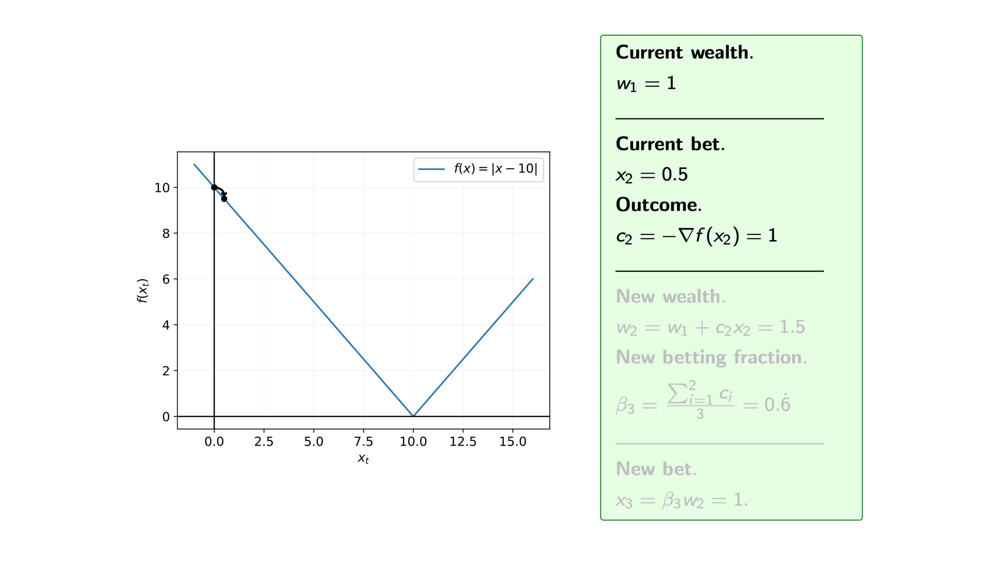
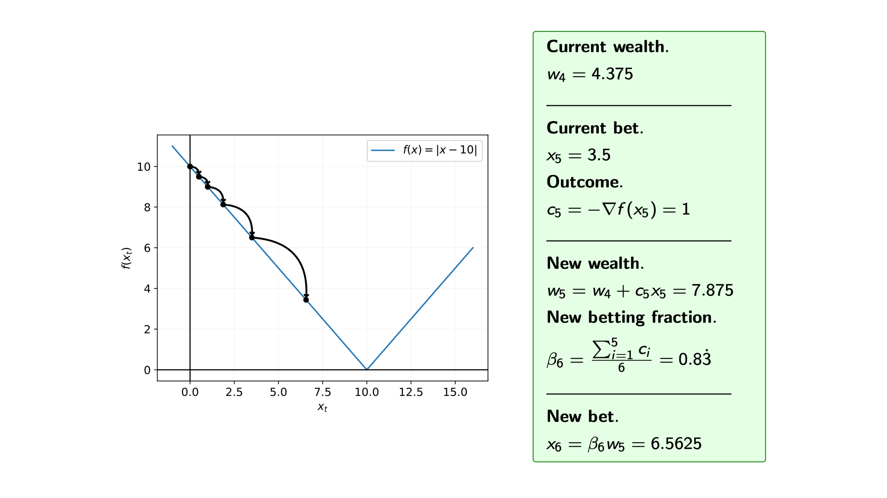
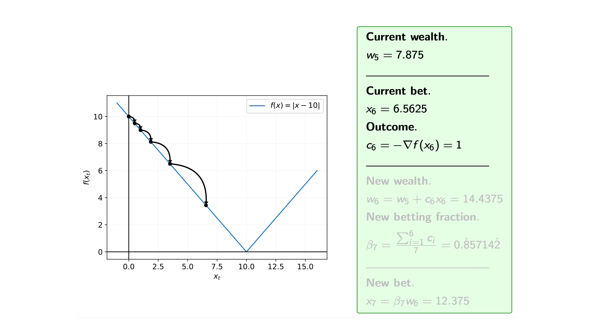
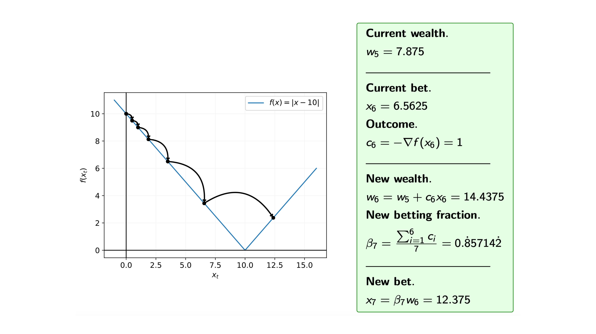
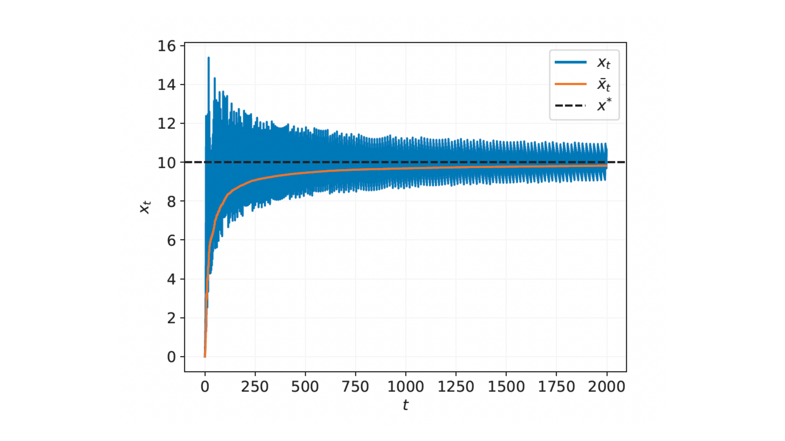
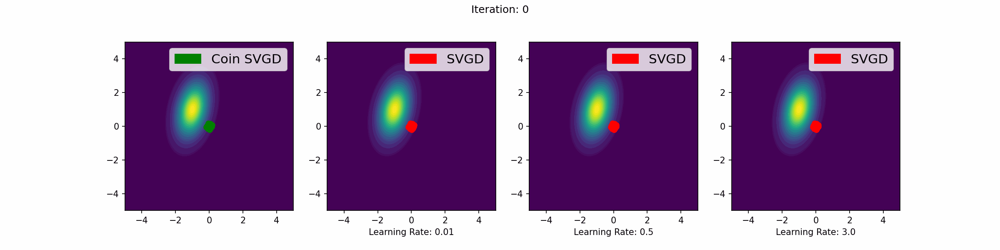
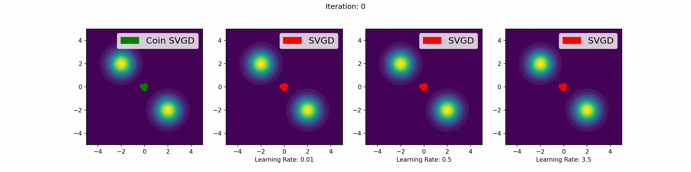

# Coin Sampling: How to make Bayesian inference learning-rate free

### Authors: Louis Sharrock, Christopher Nemeth

---

Bayesian inference is a cornerstone of modern statistics and machine learning, but its practical implementation often requires meticulous tuning of hyperparameters, particularly the learning rate (also known as the step size). In our ICML 2023 paper, "Coin Sampling: Gradient-Based Bayesian Inference without Learning Rates," we introduce a new approach to gradient-based Bayesian inference that bypasses the need for a learning rate. 

This blog post delves into the details of the coin betting algorithm, a technique from the online learning optimization literature, and how it can be applied in the Bayesian setting where our goal is draw samples from a posterior density (note that this idea is applicable beyond the Bayesian setting for generic sampling problems).

---

## The Challenge of Learning Rates

Particle-based variational inference (ParVI) methods, such as Stein variational gradient descent (SVGD) [(Liu and Wang, 2016)](https://arxiv.org/abs/1608.04471), have become a popular tool in the Bayesian machine learning literature. However, the performance of these methods critically depends on hyperparameters like the learning rate. Choosing an optimal learning rate is a non-trivial task that can significantly impact the convergence and efficiency of ParVI algorithms.

## Introducing Coin Betting

Coin betting, a concept borrowed from convex optimization, offers a novel approach to address this challenge. The core idea is to construct a gradient-based sampling method that inherently avoids the need for learning rate tuning. Before getting into our Coin Sampling algorithm, let’s first start with how coin betting works.

### Coin Betting in Optimization

The Coin Betting algorithm was first conceived by [Orabona and Pal](https://arxiv.org/abs/1602.04128) in the field of stochastic optimization and was an important contribution to the growing literature of parameter-free optimization methods. The classic scenario involves a gambler placing bets on a series of coin flips. The wealth of the gambler evolves based on the outcomes of these bets, and the goal is to design a betting strategy that guarantees convergence to an optimal solution.

#### Mathematical Formulation

Consider the optimization problem:

$$ x^* = \arg\min_{x \in \mathcal{X}} f(x), $$

where $f : \mathcal{X} \to \mathbb{R}$ is a convex function. Traditional gradient descent updates the iterate $x_t$ as follows:

$$ x_{t+1} = x_t - \gamma \nabla f(x_t), $$

where $\gamma >0$ is the learning rate. The choice of $\gamma$ is crucial for ensuring convergence.

In the coin betting approach, we can eliminate the need for a predefined learning rate by introducing a betting strategy. Let’s define the wealth $w_t$ of a gambler after $t$ rounds of betting:

$$ w_t = \epsilon + \sum_{i=1}^t c_i x_i, $$

where $\epsilon > 0$ is the initial wealth, $x_i$ is the size of the bet in the $i$-th round, and $c_i$ is the outcome of the $i$-th coin flip, which can be interpreted as the negative subgradient of $f$ at $x_i$, i.e.

$$ c_i = -\nabla f(x_i). $$

The betting strategy is defined such that the bet size $x_i$ is a fraction of the current wealth $w_{i-1}$:

$$ x_i = \beta_i w_{i-1}, $$

where $\beta_i \in [-1, 1]$ is the betting fraction. A common choice for $\beta_i$ is based on the Krichevsky-Trofimov (KT) estimator:

$$\beta_t = \frac{\sum_{i=1}^{t-1} c_i}{t}. $$

The update rule for the gambler’s wealth then becomes:

$$ x_{t+1} = x_0 + \frac{1}{t} \sum_{s=1}^{t} c_s \left( w_0 + \sum_{s=1}^{t-1} \langle c_s, x_s - x_0 \rangle \right), $$

where $\langle \cdot, \cdot \rangle$ denotes the inner product.

#### Illustrative Example

Let's see coin betting in action by considering the optimization of a simple function:

$$f(x)=|x-10|$$

This is same example that is given by Francesco Orabona in his ICML 2020 tutorial on [Parameter-Free Online Optimization](https://parameterfree.com/icml-tutorial/).

 Recall that at each iteration $i$ of the coin betting algorithm, we bet $\pounds x_i$ on the outcome $c_i = -\nabla f(x_i)$, and for the function $f$ we know that the subgradients are $\nabla f(x) \in \{-1,1\}$, i.e. $c_i=\{-1,1\}$.

 So, assuming that we start with initial wealth $w_0=1$, how does the algorithm proceed.

*Iteration 0*

*Iteration 1*

*Iteration 2*

*Iteration 3*

*Iteration 4*

*Iteration 5*

*Iteration 6*

*Iteration 7*

*Iteration 8*

*Iteration 9*

*Iteration 10*

*Iteration 11*

*Iteration 12*

*Iteration 13*

*Iteration 14*

We can see from the steps of the algorithm that we may overshoot the minimum. Therefore, we are often interested in the average of the iterates.

#### Convergence Analysis

Under suitable conditions, the coin betting algorithm guarantees convergence to the optimal solution $x^*$. Specifically, the expected suboptimality $\mathbb{E}[f(\bar{x}_T)] - f(x^*)$ after $T$ iterations satisfies:

$$ \mathbb{E}[f(\bar{x}_T)] - f(x^*) \leq \frac{K \| x^* \| \sqrt{\log(1 + 24T^2 \| x^* \|^2 / \epsilon^2)} + \epsilon}{\sqrt{T}}, $$

where $\bar{x}_T = \frac{1}{T} \sum_{t=1}^T x_t$ is the average iterate, and $K$ is a universal constant.

---

### Coin Sampling for Bayesian Inference

In the realm of Bayesian inference, the goal is to sample from a target distribution rather than finding the minimum of a function (as we've just seen in the optimization setting). So, to create a learning-rate-free Bayesian inference scheme we will need to convert the coin betting optimization algorithm to a sampling algorithm. In our ICML 2023 paper [(Sharrock and Nemeth, 2023)](https://arxiv.org/abs/2301.11294), we extend the coin betting framework from the Euclidean space to the Wasserstein space, which is where probability measures live. Here's a step-by-step overview of our coin sampling algorithm, also known as Coin Wasserstein gradient descent:

#### 1. **Initial Setup:**
   - Begin with an initial measure $\mu_0$ and a set of $N$ initial particles $\{x^i_0\}_{i=1}^N$ distributed according to $\mu_0$.
   - Assign an initial wealth $w_0$ to each particle.

#### 2. **Betting Strategy:**
   - For each iteration $t$, compute a bet for each particle based on its current wealth and a betting fraction.
   - The betting fraction is derived from the accumulated outcomes of past iterations, ensuring that the strategy adapts over time without needing a predefined step size.

#### 3. **Updating Particles:**
   - Update each particle's position by incorporating the computed bets.
   - The update rule does not require a learning rate, as it is inherently determined by the wealth and betting strategy.

#### 4. **Wasserstein Gradient Flow:**
   - The algorithm simulates a gradient flow in the Wasserstein space, ensuring that the particles move according to the optimal transport plan.
   - This approach guarantees convergence to the target distribution under certain assumptions.

### Mathematical Formulation

The core update rule in coin sampling can be expressed as:

$$ x^i_{t+1} = x^i_0 + \frac{1}{t} \sum_{s=1}^{t} c_s \left( w_0 + \sum_{s=1}^{t-1} \langle c_s, x^i_s - x^i_0 \rangle \right), $$

where $c_s$ are the outcomes (gradients) and $\langle \cdot, \cdot \rangle$ denotes the inner product. The wealth $w_t$ of each particle evolves according to the cumulative outcome of bets, thus avoiding the need for a manually tuned learning rate.

## Practical Implementation

To implement coin sampling, the authors approximate the Wasserstein gradients using an ensemble of interacting particles. This approximation allows the method to scale efficiently and be applicable in high-dimensional settings.

### Coin Stein Variational Gradient Descent (Coin SVGD)

One of the key algorithms introduced is Coin SVGD, a learning-rate-free variant of SVGD. The algorithm leverages the coin betting framework to update particles without requiring a predefined learning rate, using kernel methods to approximate gradients in the Wasserstein space.

#### The gifs that keep on giving

Here are a number of simulations on 2-dimensional targets which compared the coin sampling against SVGD, where we do a Goldilocks thing on SVGD and consider some learning rates that are too small, too large and one that is hand-tuned to be just right. 

*Doughnut distribution*

*Neal's funnel distribution*

*Gaussian distribution*

*Mixture of two Gaussians*

#### Some numerical results from the paper

The authors demonstrate the effectiveness of Coin SVGD through various numerical experiments, including:

- **Toy Examples:** Demonstrating convergence to complex, high-dimensional distributions.
- **Bayesian Independent Component Analysis (ICA):** Showing competitive performance compared to SVGD with optimal learning rates, particularly in higher dimensions.
- **Bayesian Logistic Regression:** Achieving robust performance across different learning rate scenarios, outperforming SVGD when suboptimal rates are used.
- **Bayesian Neural Networks and Matrix Factorization:** Illustrating the algorithm's adaptability and efficiency in practical machine learning tasks.

## Conclusion

The coin betting algorithm represents a significant advancement in gradient-based Bayesian inference, providing a robust and scalable solution that eliminates the need for learning rate tuning. This innovation paves the way for more efficient and user-friendly implementations of Bayesian methods in various scientific and engineering applications.

For more details on the theoretical underpinnings and empirical performance of coin sampling, you can access the full paper [here](https://arxiv.org/abs/2301.11294).

---

This post highlighted the key aspects of the coin betting algorithm and its transformative potential in Bayesian inference. Stay tuned for more insights into cutting-edge research in probabilistic machine learning!